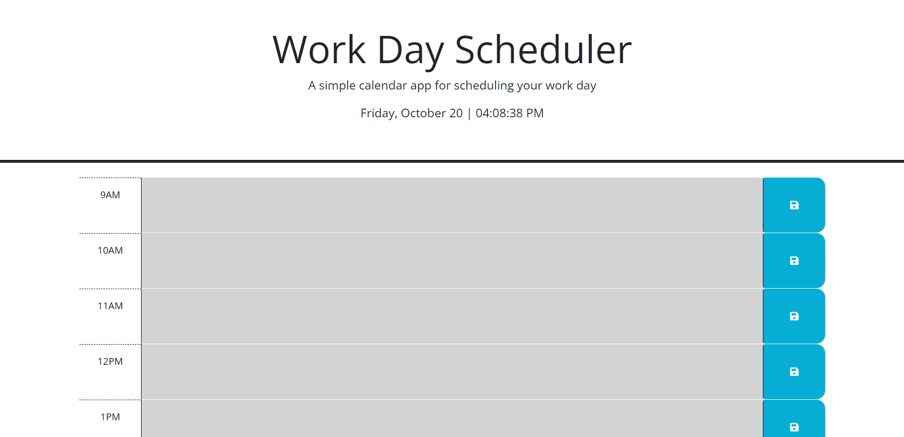
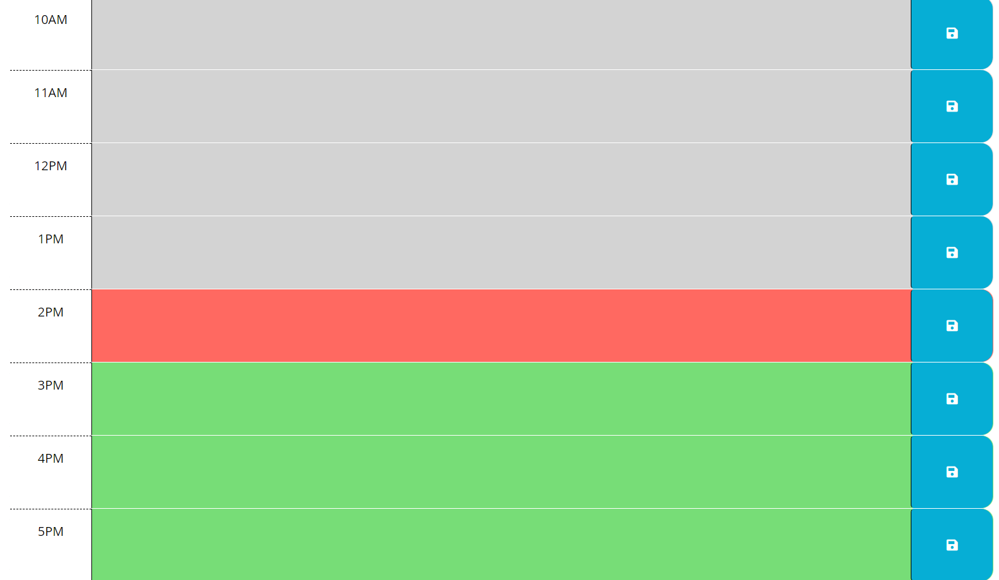
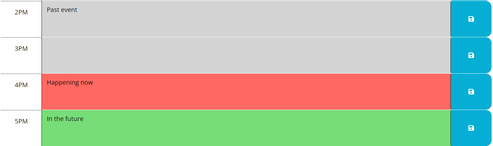

# Daily Planner

## Description

As a bootcamp student, I keep a busy schedule. Having a daily planner would help me keep track of the things I need to do. Building this project as a web application allows me to access the planner and save to-do items on my local computer. I learned about dayjs and using it to create color coding based on the hour. I also learned more about setting and getting with local storage.

## Installation

No installation required. Link to deployed application provided below:

https://andria-goodwin.github.io/daily-planner/

## Usage

The Daily Planner opens to show a header with project title and the current date and time which updates by the second. Then there are time blocks from 9am - 5pm for the typical workday. 

The time blocks are color coded based on what hour it is. The time blocks are gray when they are in the past, red when in the present, green when in the future, and blue when it is outside of the hours 9am - 5pm.

Events can be saved within the time blocks by simply entering the text in the desired time block and then clicking the corresponding save button. The event will be saved to local storage so even if you refresh the page it will be there until deleted.

## Credits

N/A

## License

Please refer to the LICENSE in the repo.